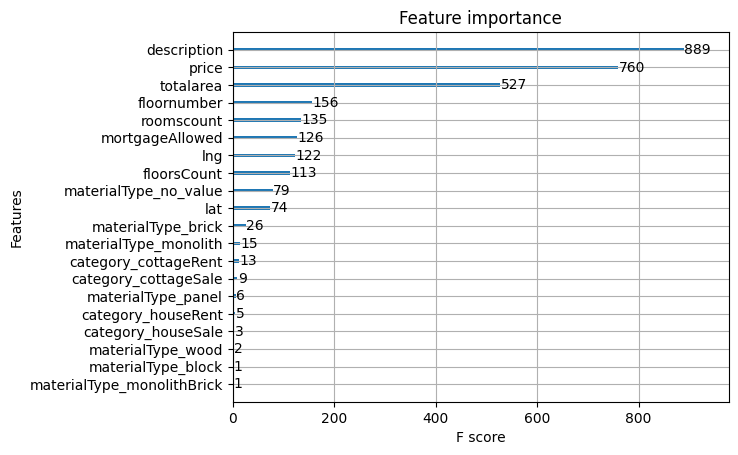
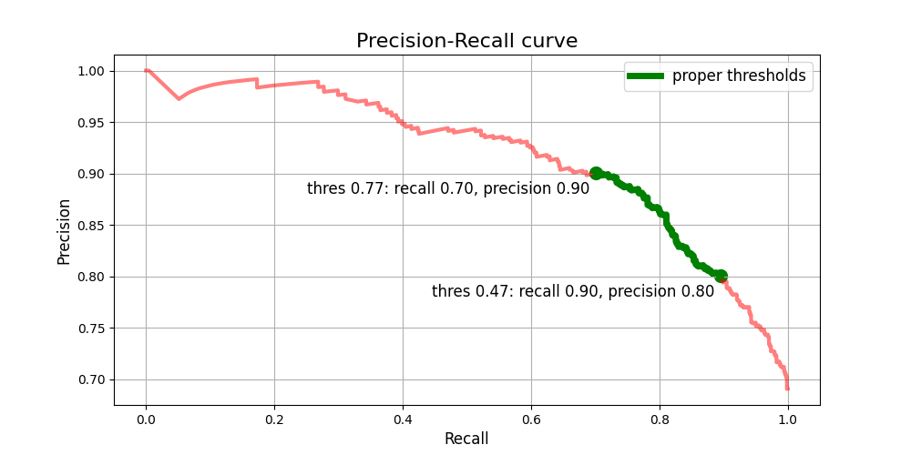

## XGBoost for finding duplicates in announcements

#### Features:
1) Numeric features:
    - geo position (lat, lng)
    - property features (totalarea, roomscount, floornumber, floorsCount)
    - price features (price, mortgageAllowed)
2) Categorical features
    - category (announcement type)
    - currency 
    - materialType (building material type)
3) Text features
    - description
    
As soon as task is binary classification (pair of announcements: duplicates / not duplicates)
features for pair were calculated as abs(features_announcement_1 - features_announcement_2).
Categorical features were processed with OHE. 
Descriptions were stemmed and lemmatized, stop words were removed.
Then result description feature is calculated as proportion of common words in pair of 
announcements.

#### Feature importance


    
#### Precision Recall curve



Green line correspond to threshold (0.47 - 0.77) were precision > 0.8 and recall > 0.7

#### Flask launch

```
docker build -t cian_task .
docker run -it --name=cian_task -p 5050:5050 cian_task bash
python app.py
```

http://localhost:5050/predict (POST with json input)
